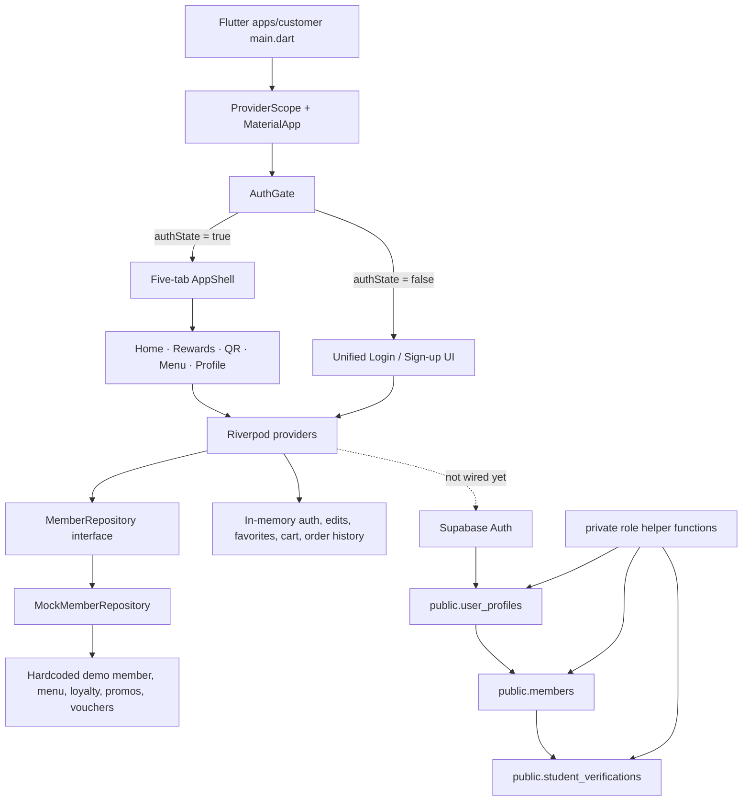

# Current Architecture

Updated: 2026-08-11

This document describes the accepted current AIDA Café architecture. Current implementation reality and future plans are separated deliberately.

## Runtime diagram

## Active applications

| Area | Current state |
|---|---|
| Customer | Flutter app in `apps/customer` |
| POS/staff | Not present |
| Admin | Not present |
| Backend/API | No custom API source present |
| Supabase | Initial database foundation exists; frontend not connected |

## Frontend boundary

The Flutter app remains a prototype frontend. Riverpod state and `MockMemberRepository` still provide customer identity, menu, loyalty, voucher, order and profile behavior in memory/source code. No Supabase dependency or client initialization exists in the Flutter app.

Protected frontend integration files remain:

- `apps/customer/lib/application/providers.dart`
- `apps/customer/lib/domain/repository/member_repository.dart`
- `apps/customer/lib/data/repository/mock_member_repository.dart`
- `apps/customer/lib/main.dart`
- `apps/customer/lib/features/shell/app_shell.dart`
- money/cart/QR-related domain models and screens

## Supabase foundation boundary

`TASK-DB-001` establishes the first trusted persistence boundary in Supabase.

Implemented database foundation:

- `public.user_profiles`: trusted application profile and role record keyed by `auth.users(id)`.
- `public.members`: server-issued membership identity and member code.
- `public.student_verifications`: student declaration and trusted review workflow.
- `private.current_app_role()` and `private.is_staff_or_above()`: non-exposed RLS helper functions.
- Auth trigger: new `auth.users` rows provision profile/member foundation records.

This foundation is intentionally narrow. It does not implement menu, orders, quote, loyalty ledger, vouchers, payments, POS/admin operations, marketing, reporting, storage, or Flutter wiring.

## Authentication and authorization

Current frontend auth is still a local boolean and must not be treated as real authentication.

Accepted direction:

- Supabase Auth owns identity/session lifecycle.
- `public.user_profiles` owns trusted app role, not user-editable metadata.
- RLS policies enforce owner and staff/admin access.
- Frontend receives only public/publishable configuration in a later task.
- Service-role keys remain server-only and must never enter Flutter/web builds.

## Current data ownership

| Data area | Current authority |
|---|---|
| User identity/session | Future Supabase Auth; frontend currently mock/local |
| Trusted profile/app role | `public.user_profiles` |
| Member code/QR identity | `public.members` |
| Student verification state | `public.student_verifications` |
| Menu/catalogue/pricing | Still mock; future schema required |
| Cart/quote/order | Still local simulation; future trusted operation required |
| Loyalty/rewards/vouchers | Still mock/display-only; future ledger/operation required |
| POS/admin/staff actions | Not present; future app/service required |

## Security boundaries

- The Flutter/web client is untrusted.
- Client-computed prices, totals, points, roles, QR payloads, verification status, member codes and order numbers are not authoritative.
- Public tables require RLS and explicit ownership or trusted operational role predicates.
- Role helper functions are outside the exposed `public` API schema.
- Anonymous access has no direct table grants in the foundation schema.

## Deferred architecture

Deferred until later tasks:

- Supabase Flutter client package/configuration.
- Auth session bootstrap/refresh/logout wiring.
- Local secure/durable member-code cache.
- Menu/catalogue schema and storage/image policy.
- Server-side cart quote/order operations and idempotency.
- Loyalty ledger, rewards, voucher issuance/use, and audit trail.
- POS/staff/admin app or service boundary.
- Reporting, marketing, observability, backup/restore and deployment runbooks.

## Fragile boundaries

The highest-risk boundary is now the seam between the mock Flutter prototype and the new Supabase foundation. Do not wire UI directly to tables until repository ports, typed failures, cache/logout behavior, and RLS tests are reviewed.