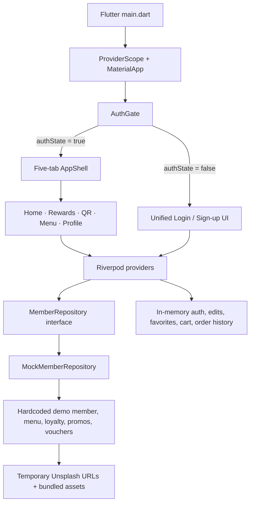

# Current Frontend Architecture

This document describes the inspected repository as it exists on 2026-08-11. Future boundaries are labeled; they are not implemented.

## Runtime diagram

Evidence: `apps/customer/lib/main.dart`, `lib/features/shell/app_shell.dart`, `lib/application/providers.dart`, and `lib/data/repository/mock_member_repository.dart`.

## Active applications and runtimes

| Area | Current state |
|---|---|
| Customer | Flutter app in `apps/customer`; Android, iOS, and web runners committed |
| Windows/macOS/Linux | No runner directories committed |
| POS/staff | Not present |
| Admin | Not present |
| Backend/API | Not present |
| Supabase | No client/config/schema/migration present |

The inspected toolchain can see Windows, Chrome, and Edge devices, but repository support and build prerequisites are separate from device detection.

## Frontend boundaries

The code approximates feature-first clean layering:

- `features/`: screens and widgets.
- `application/providers.dart`: Riverpod orchestration and mutable session state.
- `domain/model/`: Dart entities/value types.
- `domain/repository/`: the `MemberRepository` port.
- `data/repository/`: the mock adapter.
- `core/`: errors, theme, and reusable widgets.

The boundary is incomplete: screen code directly performs cart price arithmetic, order creation, generated IDs, and session persistence. The single `MemberRepository` is broad and contains no cart/order/profile-write/redeem operations.

## Navigation and routing

- Root: `MaterialApp(home: AuthGate())`.
- Auth selection: boolean `authStateProvider` selects `LoginScreen` or `AppShell`.
- Primary navigation: `selectedTabProvider` selects an `IndexedStack` of Home, Rewards, QR, Menu, and Profile.
- Secondary navigation: direct `Navigator.push` with `MaterialPageRoute` for item detail, cart, order confirmation, order history/detail, and edit profile.
- Modal surfaces: forgot-password and payment-method bottom sheets; reward details bottom sheet.
- `go_router` is installed but unused. There are no named routes, deep links, or centralized guards.

## State management

Riverpod 3 providers in `lib/application/providers.dart` own:

- repository binding and repository-backed `FutureProvider` reads;
- auth boolean;
- selected tab/category and favorites filter;
- session profile overlay;
- cart lines;
- favorite item IDs;
- session order history.

The Home daily check-in is local widget state in `home_screen.dart`, not a provider or repository operation. Item-detail size/add-ons/quantity/note and payment selection are local widget state.

## Data and repository layer

`MemberRepository` defines auth, reset request, member, points, stamps, rewards, vouchers, offers, featured item, promos, categories, popular items, and menu reads. `MockMemberRepository` is the only implementation. Typed `Result`/`Failure` types exist, but the mock returns successful results and most failure variants have no exercised adapter path.

There are no DTOs, serialization, HTTP client, Supabase client, cache, secure token store, local database, or repository-backed write operations.

## Current mock/local/session behavior

- Mock: member identity, menu, categories, prices, ratings, sizes, add-ons, loyalty, rewards, vouchers, offers, promotions, and stock images.
- Session: auth, sign-up identity overlay, profile edits, favorites, cart, order history.
- Widget-local: check-in days, item configuration, payment method, timed order status.
- Client-generated: new member ID/code, order number, timestamps, cart subtotal, ready status.

See `docs/frontend/MOCKS_AND_PLACEHOLDERS.md` for the detailed register.

## Intended Supabase/backend boundary—future, not implemented

A concrete data adapter may implement domain ports with Supabase Auth, Postgres/Data API or controlled RPC/Edge Function calls, Storage, and durable local caching. The trusted boundary must own identity, authorization, prices, availability, quotes, totals, order numbers/state transitions, points/stamps, voucher issuance/use, verification, and staff/admin roles. UI providers should orchestrate server results, not reproduce those rules.

The existing broad repository will likely need to be split or extended by capability before integration; “replace one class and change nothing else” is an aspiration, not proven by current write-path gaps.

## Authentication direction

Current auth is a boolean with no session bootstrap. The intended direction is Supabase Auth-backed session restoration, refresh/revocation handling, verified current-user reads, secure platform storage where needed, cache isolation by user, and authorization enforced by RLS/server logic. User-editable metadata must not authorize roles or student verification.

## Domain boundaries

- **Menu:** business-owned catalogue, variants/modifiers, prices, images, and availability; current data is mock.
- **Cart/quote:** current cart is client state; a server quote must validate configuration and return authoritative totals.
- **Orders:** current placement/history/status are session simulations; real state must be persisted and operationally updated.
- **Loyalty:** current values are displayed as mock data; issuance, redemption, expiry, idempotency, and ledgers must be server-controlled.
- **Membership/QR:** a static member identifier is rendered; it is shareable and must never confer authority by itself.

## Security boundaries

- The Flutter/web client is untrusted.
- Supabase secret/service-role credentials must never enter the client.
- Exposed database objects require RLS and ownership/role-aware policies.
- Staff/admin capabilities require server-verifiable authorization, not hidden UI.
- Payment instruments should remain with approved providers; the current selector does not process funds.

## Deferred architecture

Schema, API style, offline cache, secure storage, realtime order updates, background notifications, analytics, image pipeline, multi-app code sharing, POS/admin deployment, and observability remain undecided/unimplemented.

## Fragile boundaries

The highest-risk integration files are `application/providers.dart`, `member_repository.dart`, `mock_member_repository.dart`, `main.dart`, `app_shell.dart`, `cart.dart`, `cart_screen.dart`, `membership_card_screen.dart`, and visual golden baselines. See `docs/frontend/FRAGILE_BOUNDARIES.md`.
